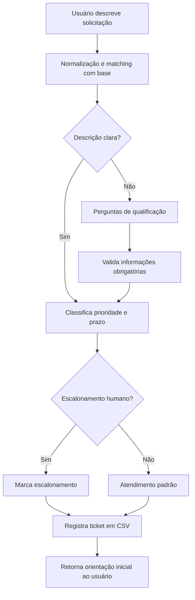

# Relatório Técnico: Agente Inteligente para Automação do Suporte de TI

## 1. Introdução

O suporte de TI é uma função crítica para a continuidade operacional das organizações, pois atende dúvidas, trata incidentes e viabiliza o acesso seguro aos recursos digitais. Em muitos contextos, o modelo tradicional é predominantemente manual: analistas coletam informações por chat ou telefone, classificam solicitações, consultam procedimentos internos e registram chamados em ferramentas de atendimento. Esse modelo, embora funcional, costuma elevar custo operacional, tempo de resposta e variabilidade na qualidade do atendimento.

Com base nesse cenário, foi desenvolvida uma solução de agente inteligente conversacional capaz de automatizar parte relevante do primeiro nível de suporte. A proposta integra interpretação de linguagem natural, consulta a base de conhecimento estruturada em planilha eletrônica e registro automático das solicitações em planilha de tickets. Além disso, o agente classifica prioridade e estima prazo de solução de forma automática, respeitando critérios definidos na base.

O projeto foi desenhado para lidar com dois contextos centrais: (a) solicitações descritas de forma clara, em que o agente responde e registra de forma imediata; e (b) solicitações ambíguas ou incompletas, em que o agente conduz perguntas de qualificação antes de prosseguir. Essa distinção é fundamental para preservar qualidade técnica e reduzir retrabalho no fluxo de atendimento.

## 2. Arquitetura da Solução

A arquitetura implementada segue um desenho modular simples e extensível, organizado em camadas de ingestão, compreensão, decisão e persistência.

1. Camada de conhecimento
- Fonte: arquivo CSV com artigos de suporte (`support_knowledge_base (1).csv`).
- Campos utilizados: título do artigo, serviço, categoria, exemplos de descrição, perguntas diagnósticas, informações obrigatórias, critérios de escalonamento, orientação de prioridade e prazo estimado.

2. Camada de interpretação
- Normalização textual (remoção de acentos, padronização para minúsculas, limpeza de caracteres).
- Cálculo de score de intenção por combinação de:
  - cobertura de palavras-chave;
  - sobreposição de termos entre descrição do usuário e conteúdo do artigo.

3. Camada de qualificação da demanda
- Detecção de ambiguidade por limiar de confiança e diferença entre os dois melhores candidatos.
- Disparo de perguntas diagnósticas para coletar contexto faltante.
- Verificação de campos obrigatórios antes do registro final.

4. Camada de decisão operacional
- Classificação automática de prioridade com base em:
  - sinais críticos na descrição (segurança, comprometimento, indisponibilidade severa);
  - orientação de prioridade do artigo da base.
- Estimativa de prazo (SLA inicial) orientada por prioridade e referência do artigo.
- Decisão de escalonamento humano para casos críticos e de segurança.

5. Camada de persistência
- Registro do ticket em CSV (`service_requests.csv`) com campos: identificador, data/hora, solicitante, descrição, artigo relacionado, prioridade, prazo estimado, necessidade de escalonamento e dados coletados.

### 2.1 Fluxo resumido

## 3. Decisões de Projeto e Justificativas

### 3.1 Uso de CSV como fonte de verdade operacional

A escolha por CSV como base de conhecimento foi estratégica para reduzir barreira de adoção. Muitas equipes de suporte já mantêm procedimentos em planilhas e podem atualizar conteúdo sem necessidade de intervenção de engenharia em cada alteração. Isso acelera governança de conteúdo e facilita manutenção contínua.

### 3.2 Regra híbrida para entendimento de intenção

Foi adotado um método híbrido leve (palavra-chave + similaridade lexical) em vez de um modelo pesado de NLP. Essa decisão privilegia:

- transparência na explicabilidade do resultado;
- menor custo computacional;
- facilidade de depuração e ajuste pela equipe de TI.

Em ambiente corporativo, explicabilidade é relevante para auditoria, melhoria do processo e confiança dos analistas.

### 3.3 Perguntas de qualificação para reduzir erro de classificação

A simples tentativa de classificar qualquer texto imediatamente pode gerar falsos positivos e incidentes mal registrados. Por isso, quando a confiança é baixa, o agente ativa uma sequência de perguntas diagnósticas. Essa etapa melhora a qualidade dos dados do ticket e reduz escalonamentos desnecessários.

### 3.4 Segurança como prioridade transversal

Casos de phishing, malware e possível comprometimento de conta são tratados com gatilhos prioritários para elevação de criticidade e escalonamento imediato. Essa decisão está alinhada à necessidade organizacional de contenção rápida em eventos de segurança.

## 4. Critérios de Priorização e Regras de Escalonamento

A priorização automática combina orientação da base com sinais de impacto operacional observados no relato do usuário.

1. Prioridade Crítica
- Incidentes de segurança com indício de comprometimento (ex.: credencial exposta, malware ativo).
- Interrupção severa com alto potencial de dano operacional.
- Ação: resposta imediata e escalonamento humano obrigatório.

2. Prioridade Alta
- Bloqueio direto da atividade principal do usuário (ex.: sem acesso VPN para trabalho remoto).
- Falhas com potencial de ampliar impacto em curto prazo.
- Ação: atendimento acelerado e monitoramento de impacto.

3. Prioridade Média
- Incidentes relevantes, porém com alternativas operacionais parciais.
- Ação: fluxo padrão com SLA intermediário.

4. Prioridade Baixa
- Requisições planejadas ou com baixo impacto imediato.
- Ação: fila regular de atendimento.

### 4.1 Regras de escalonamento humano

O agente encaminha para atendimento humano quando ocorre ao menos um dos fatores abaixo:

- risco de segurança da informação;
- ausência de validação de identidade em casos sensíveis;
- indício de falha coletiva ou incidente maior;
- necessidade de aprovação formal (ex.: concessão de acesso);
- impossibilidade de concluir diagnóstico por falta de dados críticos.

Esse mecanismo evita automação cega e preserva controle humano nos casos de maior risco.

## 5. Resultados Obtidos

No protótipo implementado, os seguintes resultados foram comprovados:

- leitura bem-sucedida da base de conhecimento e indexação dos artigos;
- identificação automática de intenção com mapeamento para artigo mais aderente;
- execução de qualificação conversacional em cenários ambíguos;
- classificação automática de prioridade e prazo estimado;
- registro automático de chamados com histórico estruturado.

Como validação técnica, um caso de falha de VPN foi corretamente associado ao artigo específico de acesso remoto (`KB-008`), classificado com prioridade alta e registrado como ticket com metadados completos.

## 6. Limites da Automação e Análise Crítica de Valor

### 6.1 Potencial de geração de valor

O agente proposto pode gerar valor em quatro frentes principais:

1. Eficiência operacional
- Redução do tempo gasto por analistas em triagem inicial e coleta repetitiva de informações.

2. Padronização de atendimento
- Aplicação consistente de perguntas diagnósticas, critérios de prioridade e orientações de contorno.

3. Escalabilidade
- Capacidade de absorver grande volume de solicitações de baixa e média complexidade.

4. Governança e rastreabilidade
- Registro estruturado dos atendimentos para auditoria, métricas e melhoria contínua.

### 6.2 Limites e riscos

Apesar dos ganhos, a automação possui limites importantes:

- Dependência da qualidade da base: conteúdo desatualizado implica resposta inadequada.
- Ambiguidade linguística: descrições muito vagas podem induzir classificação imperfeita.
- Casos excepcionais: eventos raros ou inéditos exigem julgamento técnico humano.
- Risco de excesso de confiança: usuários podem interpretar resposta automática como decisão final em casos sensíveis.

Esses limites reforçam que o melhor desenho é híbrido: automação para triagem e encaminhamento, com supervisão humana nos pontos críticos.

## 7. Conclusão

A solução implementada demonstra viabilidade técnica e organizacional para modernizar o suporte de TI com agente inteligente conversacional. O sistema atende aos requisitos centrais: conversa em linguagem natural, consulta base estruturada, qualifica demandas ambíguas, registra solicitações, define prioridade e estima prazo automaticamente.

Do ponto de vista arquitetural, as decisões adotadas equilibram simplicidade, transparência e capacidade de evolução. Do ponto de vista de negócio, a proposta tende a reduzir custo operacional, melhorar a experiência do usuário interno e aumentar a maturidade de gestão do service desk.

Como próximos passos, recomenda-se evoluir o protótipo para integração com APIs de ITSM, observabilidade de métricas (SLA, reincidência e taxa de escalonamento), e mecanismos semânticos mais robustos para interpretação de linguagem natural em cenários de alta variabilidade.
