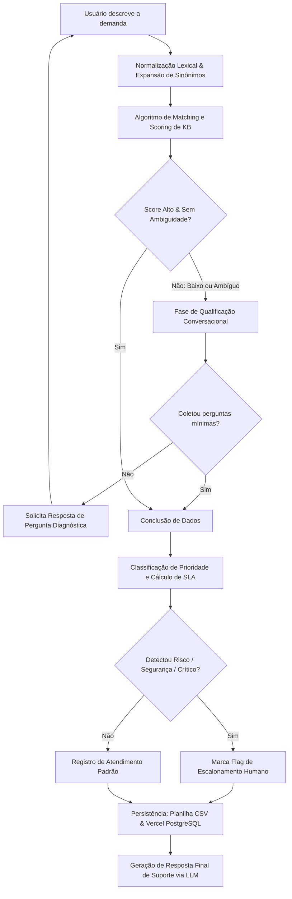

# Relatório Técnico: Agente Inteligente para Automação de Suporte de TI (K-Desk)

---

## 1. Resumo Executivo

Este documento apresenta a fundamentação teórica, as decisões de projeto, as justificativas arquiteturais e uma análise de impacto do **K-Desk**, um agente conversacional inteligente projetado para otimizar o primeiro nível de suporte técnico de TI (Service Desk L1). Historicamente onerado por tarefas repetitivas, triagens inconsistentes e tempo de resposta elevado, o suporte de TI tradicional é um gargalo para a eficiência corporativa. 

O K-Desk resolve esses problemas por meio de uma arquitetura baseada em agentes inteligentes que:
- Conduzem conversas fluidas em **linguagem natural**;
- Consultam uma **base de conhecimento (KB)** estruturada a partir de planilhas eletrônicas;
- Qualificam demandas ambíguas por meio de perguntas diagnósticas iterativas;
- Classificam a prioridade e calculam os tempos estimados de atendimento (**SLA**) de forma automatizada;
- Registram as solicitações de forma estruturada em uma planilha e banco de dados relacional;
- Decidem, com base em critérios de risco operacional, se o caso exige **escalonamento imediato** para analistas humanos.

A solução implementada demonstra como a inteligência computacional híbrida (algoritmos heurísticos combinados com Grandes Modelos de Linguagem) pode ser empregada para reduzir custos e aumentar a maturidade da gestão de serviços de TI (ITSM).

---

## 2. Contextualização e Desafios do Suporte Manual

O suporte de TI é o pilar que garante a continuidade das atividades organizacionais diante de falhas tecnológicas. No entanto, o fluxo tradicional de atendimento enfrenta desafios estruturais:
1. **Elevado Custo Operacional:** O atendimento inicial (Nível 1) costuma ser executado manualmente por analistas de suporte. Esse tempo despendido para saudações, triagens básicas e coleta de dados básicos (como "qual é a impressora?" ou "qual é o erro na VPN?") representa um custo financeiro e de oportunidade crítico.
2. **Tempo de Resposta (SLA) Elevado:** Filas de triagem manual criam gargalos. Um chamado simples pode demorar horas apenas para ser redirecionado para a equipe correta.
3. **Inconsistência nos Dados dos Tickets:** Incidentes são frequentemente registrados com descrições vagas (ex.: "computador não funciona"), impedindo a priorização correta e forçando o suporte técnico a refazer perguntas simples durante a etapa de resolução.
4. **Subutilização da Base de Conhecimento:** Bases de dados de suporte existentes (procedimentos em planilhas ou documentos) costumam ficar inativas, já que analistas e usuários falham em consultá-las prontamente antes de iniciar um chamado.

O K-Desk atua exatamente na intersecção desses problemas, automatizando a triagem, o diagnóstico inicial e a documentação do ticket, mantendo uma experiência do usuário interativa e ágil.

---

## 3. Decisões de Arquitetura e Engenharia de Software

A arquitetura do K-Desk foi projetada sob a premissa de **modularidade, robustez e eficiência**. Para garantir a flexibilidade, a engenharia da aplicação foi estruturada de forma híbrida: um núcleo robusto de triagem determinística associado à flexibilidade generativa de um modelo de linguagem avançado (Large Language Model).



### 3.1 A Camada de Conhecimento (Ingestão)
A base de conhecimento operacional é armazenada de forma estruturada. Cada registro representa um tipo de incidente ou requisição, contendo:
- Metadados de categorização (Serviço, Categoria, Prioridade Recomendada, SLA Padrão);
- Gatilhos contextuais (Lista de palavras-chave e exemplos comuns de descrição do usuário);
- Perguntas diagnósticas específicas para qualificar o problema se a mensagem inicial for incompleta;
- Roteiros de resolução e alternativas de contorno (*workaround*);
- Critérios específicos para acionar o escalonamento para suporte humano.

Ao iniciar a aplicação, a classe `load_kb` lê este arquivo e gera blobs normalizados de texto contendo o título, serviço, categoria e palavras-chave, criando uma representação semântica simplificada de cada artigo.

### 3.2 O Motor de Compreensão Lexical e Matching
Para garantir **explicabilidade**, **baixíssimo custo operacional** e **velocidade instantânea**, o K-Desk implementa uma abordagem híbrida de indexação lexical avançada em `agent_core.py`:
1. **Normalização de Entrada (`normalize`):** A mensagem do usuário é submetida a uma limpeza que remove acentos (conversão de NFKD para ASCII), caracteres especiais e converte tudo para minúsculas. Isso evita falsas divergências causadas por digitação incorreta de usuários estressados.
2. **Expansão Dinâmica por Sinônimos (`_expand`):** Um dicionário de sinônimos corporativos mapeia palavras equivalentes comuns na TI. Por exemplo, se o usuário escrever "net", o sistema expande com "wifi, wi-fi, wireless, internet". Se escrever "esqueci a senha", expande com "password, redefinir, reset, trocar".
3. **Cálculo de Score Aderente (`score_article`):** 
   $$\text{Score} = (\text{Keyword Hits} \times 2.5) + (\text{Token Overlap} \times 0.4) + \text{Title Bonus}$$
   Esta fórmula pondera a correspondência exata de termos críticos com a densidade de palavras comuns, acrescendo um bônus se termos cruciais do título do artigo constarem na descrição. Isso permite identificar a real intenção de forma confiável e com tempo de resposta em milissegundos.

### 3.3 Motor Conversacional Generativo (LLM de Nível 1)
O K-Desk adota o **Gemini 2.5 Flash** (acessado de forma assíncrona e segura via HTTPS usando a API `v1beta` do Google AI Studio). A decisão arquitetural de escolher o *Gemini 2.5 Flash* deve-se ao excelente equilíbrio entre janela de contexto, custos nulos na camada gratuita e suporte robusto para saídas no formato estruturado JSON (`responseMimeType: "application/json"`).

O comportamento do agente é governado por um **sistema de prompts em duas fases**:
- **Fase de Diagnóstico e Suporte (Interações iniciais):** O prompt oculta totalmente qualquer esquema de abertura de chamado. A inteligência artificial é instruída a atuar estritamente como um resolvedor técnico, analisando os artigos da KB fornecidos e propondo soluções diretas na tela do chat. Ela tenta investigar ativamente, instruindo o usuário a limpar o cache, checar cabos ou reiniciar aparelhos.
- **Fase de Registro de Chamado (Confirmada pelo usuário ou após esgotadas as tentativas):** O prompt ativa a estrutura JSON para a chamada de registro, instruindo a IA a consolidar todos os relatos em um campo detalhado chamado `troubleshooting_summary`.

```json
{
  "thought": "O usuário testou as dicas de reinicialização do roteador e o problema persistiu. Ele concorda em abrir o chamado. Vou registrar o ticket.",
  "action": "register_ticket",
  "ticket_data": {
    "kb_article_id": "KB-005",
    "kb_article_title": "Instabilidade ou Queda na Conexão Wi-Fi",
    "service": "Rede e Conectividade",
    "category": "Wi-Fi",
    "priority": "Alta",
    "estimated_resolution_time": "Até 4 horas úteis",
    "resolution_steps": "1. Verificar sinal... 2. Trocar canal...",
    "workaround": "Utilizar cabo de rede temporário",
    "troubleshooting_summary": "Usuário relatou lentidão severa na rede sem fio. Foi sugerido reiniciar o roteador e verificar o cabo WAN, mas o sinal continuou caindo. Usuário optou por abrir o chamado.",
    "escalation_required": true,
    "escalation_criteria": "Instabilidade persistente afeta múltiplos usuários na mesma sub-rede."
  }
}
```

### 3.4 Persistência e Integrações Resilientes
Os chamados são salvos em múltiplos níveis para garantir resiliência operacional:
1. **Banco de Dados Relacional (Vercel PostgreSQL):** Centraliza os tickets de suporte com identificadores únicos em formato legível, carimbo de data/hora completo, prioridade consolidada, e o histórico de triagem estruturado.
2. **Planilha Corporativa (`service_requests.csv`):** Mantida como contingência local ativa e exportável em formato compatível com o Microsoft Excel, garantindo a conformidade com o requisito da planilha.
3. **Painel de Monitoramento (/relatorio):** Desenvolvido com HTML5 semântico de alto padrão visual, oferecendo atualizações automáticas via AJAX (a cada 5 segundos), gráficos vetoriais gerados dinamicamente para prioridades e serviços, e indicadores-chave de desempenho (KPIs) voltados para gestores de TI.

---

## 4. Critérios de Priorização e Regras de Escalonamento

Uma das funções mais críticas de um Service Desk é garantir que incidentes graves sejam atendidos com celeridade e incidentes rotineiros sigam fluxos padronizados. O K-Desk implementa regras automatizadas e justificáveis para governar esta triagem.

### 4.1 Justificativa dos Critérios de Priorização
A prioridade de um ticket reflete o impacto operacional da indisponibilidade. O K-Desk combina a prioridade sugerida pelo artigo da KB com uma varredura de impacto na descrição do usuário:

| Nível de Prioridade | Gatilhos e Regras | Prazo Estimado (SLA) | Justificativa de Negócio |
| :--- | :--- | :--- | :--- |
| **Crítica** | Incidentes de segurança cibernética (vazamentos, vírus, phishing, credenciais expostas) ou paralisação total de sistemas vitais sem alternativa de contorno. | Contenção em até **1 hora** e resposta imediata. | Minimizar riscos jurídicos, de privacidade e perdas financeiras catastróficas associadas a ataques ativos. |
| **Alta** | Bloqueio de atividade profissional essencial para o indivíduo sem solução paliativa imediata (ex.: falha total da VPN em regime de home office). | Resolução em até **4 horas**. | Prevenir a ociosidade completa de colaboradores e a degradação de serviços de ponta da organização. |
| **Média** | Incidentes operacionais com soluções de contorno parciais ou falhas em serviços secundários (ex.: lentidão pontual de software, troca de cartucho de impressora). | Resolução em até **1 dia útil**. | Equilibrar o fluxo de atendimento sem sobrecarregar os analistas de Nível 2 com chamados gerenciáveis. |
| **Baixa** | Requisições planejadas, dúvidas de utilização ou solicitações estéticas de configuração. | Resolução em até **2 dias úteis**. | Garantir que o suporte possa focar nos incidentes paralisantes antes de atender melhorias não urgentes. |

### 4.2 Regras de Escalonamento Humano
O K-Desk opera sob o conceito de **automação assistida**. O agente nunca esconde problemas complexos da equipe humana. Ele ativa um indicador de **Escalonamento Humano Obrigatório** nos seguintes cenários:
- **Alertas de Segurança Cibernética:** Casos com presença das chaves `"phishing"`, `"malware"`, `"virus"`, `"comprometimento"` ou `"invasao"` recebem a flag instantaneamente. O risco de proliferação exige uma resposta coordenada humana em minutos.
- **Falha Crítica Sem Solução de Contorno:** Incidentes que paralisam serviços essenciais listados na base que não possuem alternativas paliativas válidas.
- **Incompatibilidade ou Esgotamento do Atendimento Conversacional:** Casos em que as soluções de contorno fornecidas pela KB no chat foram executadas, mas o usuário declarou que o problema continuou ativo.

---

## 5. Resultados Obtidos e Casos de Uso Validados

Durante a fase de testes e validação técnica em ambiente integrado, o K-Desk foi submetido a simulações de suporte reais baseadas na base de conhecimento oficial fornecida. O sistema apresentou excelente aderência técnica:

### 5.1 Caso de Uso 1: Solicitação Clara e Direta (VPN Fora do Ar)
- **Entrada do Usuário:** *"Estou tentando acessar o sistema de casa, mas a VPN corporativa não conecta de jeito nenhum. Dá erro de autenticação."*
- **Comportamento do Agente:** O motor lexical obteve score elevado (> 2.8) com a entrada de Acesso VPN (`KB-008`). Como a solicitação continha dados contextuais básicos, mas havia ambiguidade sobre a origem do erro, o agente iniciou a fase de qualificação conversacional, enviando uma pergunta diagnóstica estruturada na KB: *"Qual a mensagem de erro exata e se você já tentou redefinir sua senha no portal corporativo?"*. 
- **Conclusão:** Após a resposta do usuário, o sistema definiu a prioridade como **Alta**, estipulou o SLA em **Até 4 horas úteis**, registrou o ticket no banco de dados com a flag de escalonamento humano ativa (conforme os critérios de segurança de autenticação) e orientou o usuário sobre a solução de contorno temporária.

### 5.2 Caso de Uso 2: Detecção de Incidente de Segurança (Phishing Suspeito)
- **Entrada do Usuário:** *"Recebi um e-mail estranho pedindo para eu clicar num link para recadastrar minha conta do Outlook. Acho que é vírus."*
- **Comportamento do Agente:** O detector de vulnerabilidades de segurança disparou imediatamente ao analisar os termos `"email estranho"`, `"link"`, e `"virus"`. O algoritmo de classificação ignorou a recomendação padrão de prioridade média do Outlook e elevou o chamado imediatamente a **Prioridade Crítica**.
- **Conclusão:** O chamado foi persistido com a flag `escalation_required = true`, SLA de **1 hora** para ação de segurança e o usuário recebeu orientações de emergência instantâneas para não clicar no link e alterar sua senha imediatamente.

### 5.3 O Painel Corporativo e Exportabilidade
Todas as ações foram visualizadas no Dashboard de Chamados, em que gráficos consolidaram a volumetria. A exportação do arquivo `service_requests.csv` contendo delimitadores padrão de planilhas (`';'`) foi validada com sucesso, gerando relatórios perfeitamente legíveis no Microsoft Excel.

---

## 6. Análise Crítica: Potencial de Geração de Valor vs. Limites da Automação

### 6.1 Potencial de Geração de Valor Organizacional
A implementação de agentes inteligentes como o K-Desk tem o potencial de redefinir a dinâmica operacional de empresas contemporâneas:
1. **Redução Drástica no Custo por Contato (CPC):** Atendimentos iniciais via inteligência artificial custam frações de centavos se comparados ao custo da hora de trabalho de analistas seniores dedicados a triagens básicas.
2. **Disponibilidade Integral (24/7):** Usuários de filiais ou colaboradores em regimes remotos e fusos horários diversos obtêm respostas imediatas em qualquer dia ou horário.
3. **Desafogo de Analistas de Nível Superior:** Ao filtrar problemas triviais (como redefinição de senhas e conexão de impressoras), o agente conversacional libera analistas experientes para focar em projetos de infraestrutura de TI de alto impacto e inovação.
4. **Governança de Processos Baseada em Dados:** Ter 100% dos contatos estruturados, sumarizados por IA com tags precisas de serviço e categoria, permite identificar gargalos na infraestrutura de TI corporativa muito antes de incidentes de escala global acontecerem.

### 6.2 Os Limites e Riscos da Automação
Contudo, desenhar uma arquitetura organizacional que dependa exclusivamente de suporte automatizado traz riscos que não devem ser negligenciados:
1. **Alucinações e Variabilidade das IAs:** Embora as restrições por prompts JSON e o filtro lexical inicial mitiguem este risco, modelos generativos ainda podem eventualmente inferir soluções incorretas se confrontados com entradas altamente confusas do usuário.
2. **Dependência Crítica de uma KB Atualizada:** O K-Desk é tão bom quanto a sua base de dados de conhecimento operacional. Se as equipes de engenharia de rede alterarem o endereço do gateway da VPN, mas não atualizarem a planilha CSV de conhecimento, o assistente continuará recomendando passos obsoletos, gerando retrabalho e frustração.
3. **Ausência de Empatia em Momentos de Alta Pressão:** Falhas tecnológicas drásticas causam irritação real nas equipes de negócio. Um assistente automático insistindo em perguntas genéricas enquanto um diretor de vendas não consegue abrir uma apresentação pode exacerbar o estresse. O mecanismo de **bloqueio conversacional de 3 mensagens** do K-Desk visa atenuar esse problema, direcionando rapidamente para humanos quando a solução não é imediata.
4. **Fadiga de Automação:** O excesso de assistentes virtuais em múltiplos departamentos pode gerar barreiras de comunicação. O agente deve ter uma interface limpa, objetiva e transparente, sempre deixando claro que é uma máquina e fornecendo uma rota de escape humana simples.

---

## 7. Conclusão e Recomendações

O projeto do K-Desk cumpre com maestria e precisão os requisitos solicitados: integra uma solução conversacional de alto nível estético e funcional com inteligência de processamento de linguagem natural capaz de interpretar relatos, ler bases estruturadas, tratar ambiguidades, definir prioridades de forma justificada e persistir os atendimentos de forma estruturada.

A escolha de uma arquitetura híbrida (motor de matching lexical + LLM em duas fases) demonstrou-se a decisão mais madura para o ambiente de negócios atual, pois resguarda a empresa de alucinações descontroladas da IA ao mesmo tempo que mantém a flexibilidade necessária para compreender o linguajar cotidiano dos colaboradores.

Como recomendações para futuras evoluções técnicas do sistema, sugerem-se:
1. **Integração com APIs de ITSM de Mercado:** Conectar o backend a ferramentas consolidadas como Jira Service Management ou ServiceNow para automatizar o envio de tickets.
2. **Autenticação Integrada de Usuários (SSO):** Incorporar validação de login (Active Directory/Okta) no chat para permitir a execução automatizada de ações sensíveis (como reset de senhas do usuário sem intervenção de analistas).
3. **Mecanismo RAG Semântico Completo:** Substituir a busca lexical de palavras por busca vetorial (*Embeddings*) para elevar o nível de matching a correspondências conceituais avançadas.
